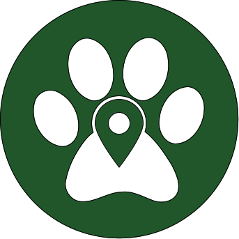
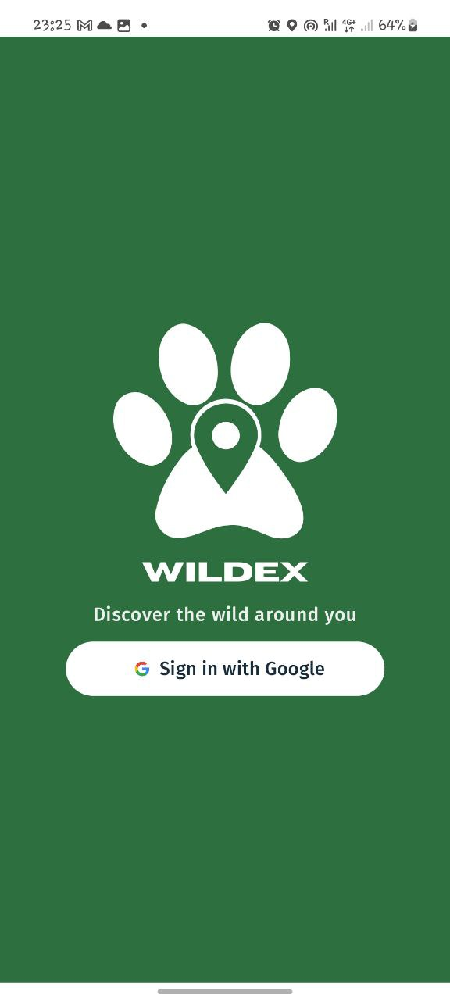
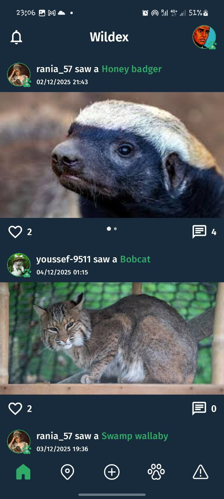
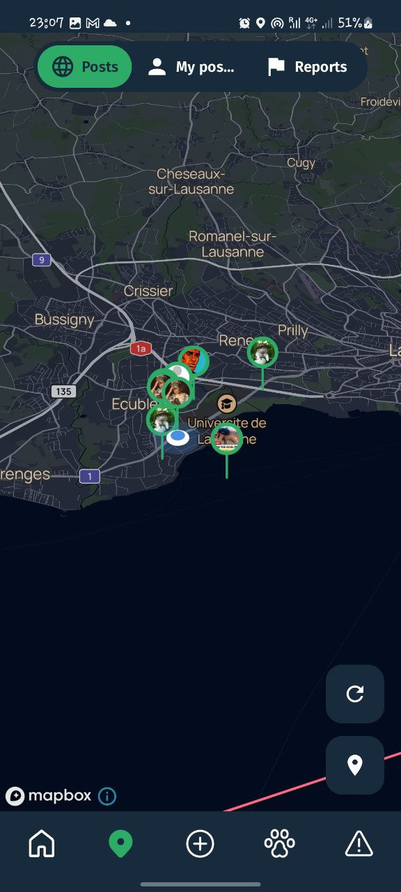
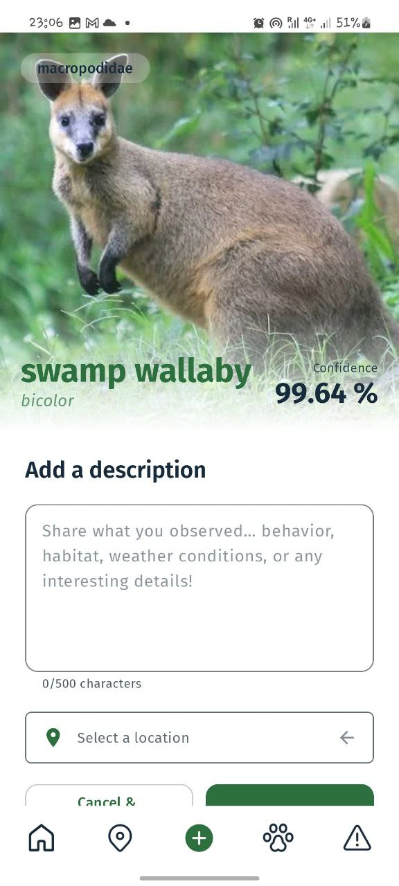
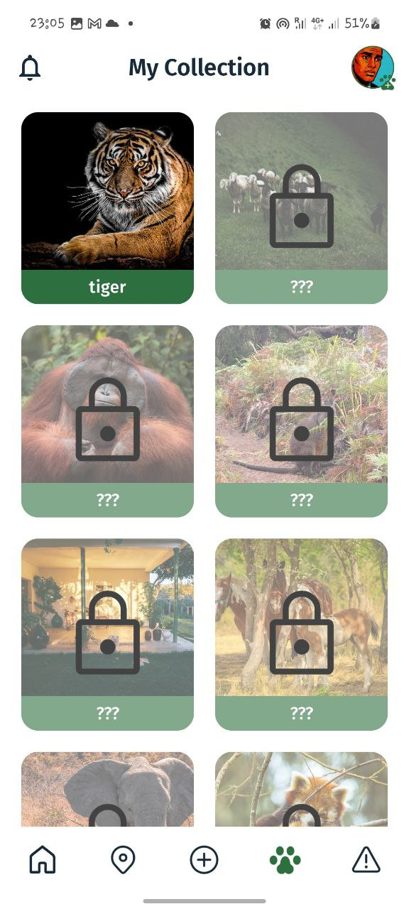
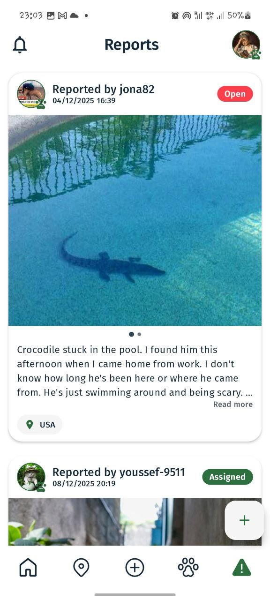

<!-- Improved compatibility of back to top link -->

<!-- PROJECT LOGO -->
 

  

<h3 align="center">Wildex</h3>

  

    Discover the wild around you.
     
    <a href="https://github.com/wildex-swent/wildex-app/wiki"><strong>Explore our wiki »</strong></a>
     
     
    <a href="https://github.com/wildex-swent/wildex-app/issues/new?labels=bug&template=bug-report---.md">Report Bug</a>
    ·
    <a href="https://github.com/wildex-swent/wildex-app/issues/new?labels=enhancement&template=feature-request---.md">Request Feature</a>
  

[![Contributors][contributors-shield]][contributors-url]
[![Stargazers][stars-shield]][stars-url]
[![Issues][issues-shield]][issues-url]
[![Release][release-shield]][release-url]

<!-- TABLE OF CONTENTS -->

  
Table of Contents

  <ol>
    <li><a href="#about-the-project">About The Project</a></li>
    <li><a href="#pitch">Pitch</a></li>
    <li><a href="#features">Features</a></li>
    <li><a href="#built-with">Built With</a></li>
    <li><a href="#architecture">Architecture</a></li>
    <li><a href="#multi-user-support">Multi-User Support</a></li>
    <li><a href="#sensor-integration">Sensor Integration</a></li>
    <li><a href="#offline-mode">Offline Mode</a></li>
    <li><a href="#figma-design">Figma Design</a></li>
  </ol>

<!-- ABOUT THE PROJECT -->
## About The Project

  
  
  
  
  
  

**Wildex** is a mobile application focused on wildlife exploration and reporting.   It allows users to identify animals from a picture, post sightings, and get informations about the encountered animals. In addition to regular sightings, users can create reports for animals that appear injured, endangered, or otherwise at risk. These reports are meant to make potentially critical situations visible to professional users who are able to respond.

(<a href="#readme-top">back to top</a>)

<!-- PITCH -->
## Pitch

Have you ever come across an animal you couldn’t identify and wished you had the answer right away?
Wildex addresses this by letting users take a picture of an animal and obtain its name directly within the app. Beyond identification, Wildex allows users to build a personal collection of animals, keep track of their sightings on an interactive map, and share discoveries with others. Users can follow friends or other explorers to see their activity, making the experience more social and exploratory.
When an animal appears injured, endangered, or out of place, a report can be created and shared with professional users, helping connect field observations with people who are able to respond.
Wildex is aimed at nature lovers, hikers, and travelers who want to better understand and document wildlife encounters, as well as professionals such as biologists or veterinarians who benefit from structured, community-driven reporting.

(<a href="#readme-top">back to top</a>)

<!-- FEATURES -->
## Features

* Identify animals by taking a picture
* Record sightings with location and date
* Personal collections with name, species, and description
* Interactive map with geolocated discoveries
* Social features such as befriending users and sharing sightings
* Reporting system for injured or endangered animals
* Offline usage to access animal collection
* Push notifications

(<a href="#readme-top">back to top</a>)

<!-- BUILT WITH -->
## Built With

* [![Kotlin][Kotlin-badge]][Kotlin-url]
* [![Jetpack Compose][Compose-badge]][Compose-url]
* [![Firebase][Firebase-badge]][Firebase-url]
* [![Mapbox][Mapbox-badge]][Mapbox-url]
* [![Android Studio][Android-badge]][Android-url]

(<a href="#readme-top">back to top</a>)

<!-- ARCHITECTURE -->
## Architecture

Wildex is built as a modular Android application backed by cloud services.  
The architecture is designed to support offline usage, real-time updates, and multiple user roles.
Core components include Firebase for authentication, data storage, and notifications, as well as Mapbox for map rendering and geolocation features.

  
<strong>View full app architecture diagram</strong>

   

  

    
  

(<a href="#readme-top">back to top</a>)

<!-- MULTI-USER SUPPORT -->
## Multi-User Support

* Users authenticate via **Firebase Authentication** (currently using Google Sign-In)
* Each user has a personal profile with collections and sightings
* Two user roles are supported:
  * **Regular users:** record sightings and explore the map
  * **Professional users:** in addition to regular users actions, can access and manage animal reports

(<a href="#readme-top">back to top</a>)

<!-- SENSOR INTEGRATION -->
## Sensor Integration

Wildex relies on standard device sensors to support its functionality:

* **Camera:** used to take pictures for sightings and reports
* **GPS:** used to record the location of sightings and reports

(<a href="#readme-top">back to top</a>)

<!-- OFFLINE MODE -->
## Offline Mode

* Sightings, collections, and reports data remain accessible while offline
* Online-only features are temporarily disabled while offline
* User has access to his profile informations while offline

(<a href="#readme-top">back to top</a>)

<!-- FIGMA DESIGN -->
## Figma Design

You can view the UI design of Wildex on [Figma.](https://www.figma.com/design/1JJDxqvf0pTM0Jg3E8u0oX/Wildex-App-Desgin?node-id=0-1&t=xND19ky1WJj4gFU2-1)

(<a href="#readme-top">back to top</a>)

<!-- ATTRIBUTION -->
## Attribution

This README is based on the structure and template provided by [Best-README-Template](https://github.com/othneildrew/Best-README-Template) by Othneil Drew.

<!-- MARKDOWN LINKS & IMAGES -->
[contributors-shield]: https://img.shields.io/github/contributors/wildex-swent/wildex-app.svg?style=for-the-badge
[contributors-url]: https://github.com/wildex-swent/wildex-app/graphs/contributors
[stars-shield]: https://img.shields.io/github/stars/wildex-swent/wildex-app.svg?style=for-the-badge
[stars-url]: https://github.com/wildex-swent/wildex-app/stargazers
[issues-shield]: https://img.shields.io/github/issues/wildex-swent/wildex-app.svg?style=for-the-badge
[issues-url]: https://github.com/wildex-swent/wildex-app/issues
[release-shield]: https://img.shields.io/github/v/release/wildex-swent/wildex-app?style=for-the-badge
[release-url]: https://github.com/wildex-swent/wildex-app/releases
[Kotlin-badge]: https://img.shields.io/badge/Kotlin-0095D5?style=for-the-badge&logo=kotlin&logoColor=white
[Kotlin-url]: https://kotlinlang.org/
[Compose-badge]: https://img.shields.io/badge/Jetpack%20Compose-4285F4?style=for-the-badge&logo=jetpackcompose&logoColor=white
[Compose-url]: https://developer.android.com/jetpack/compose
[Firebase-badge]: https://img.shields.io/badge/Firebase-FFCA28?style=for-the-badge&logo=firebase&logoColor=black
[Firebase-url]: https://firebase.google.com/
[Mapbox-badge]: https://img.shields.io/badge/Mapbox-000000?style=for-the-badge&logo=mapbox&logoColor=white
[Mapbox-url]: https://www.mapbox.com/
[Android-badge]: https://img.shields.io/badge/Android%20Studio-3DDC84?style=for-the-badge&logo=androidstudio&logoColor=white
[Android-url]: https://developer.android.com/studio
